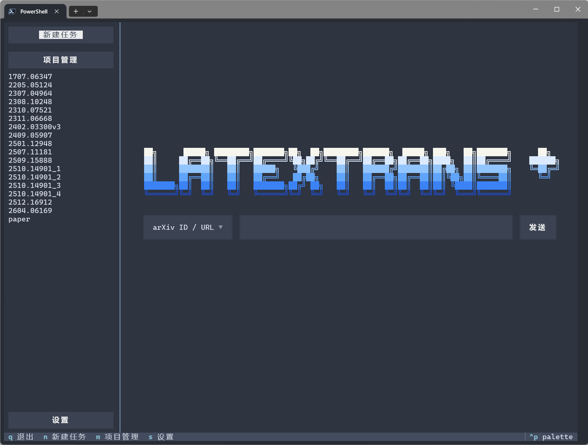

<div align="center">

[English](README.md) | 中文

</img>

  **LaTeXTransPlus**

  **直接翻译 LaTeX 论文源码，并在尽量保持文档结构的前提下生成多语言 PDF。**

</div>

<div align="center">
<p dir="auto">

• [简介](#-简介)
• [功能特性](#-功能特性)
• [安装](#-安装)
• [配置](#️-配置)
• [使用方法](#-使用方法)
• [输出结果](#-输出结果)
<!-- • [翻译示例](#️-翻译示例) -->
• [致谢](#-致谢)

</p>
</div>

# 📖 简介

LaTeXTransPlus 是一个基于原 LaTeXTrans 项目开发的 LaTeX 论文翻译工具。它直接翻译 LaTeX 源码项目，而不是翻译已经渲染后的 PDF，然后重构翻译后的 LaTeX 项目并编译生成 PDF。

当前实现会协调 Parser、Terminology Generator、Translator、Validator 和 PDF Generator 完成工作流。项目支持从 arXiv 下载源码、处理本地 LaTeX 项目、处理压缩源码包、生成项目级术语表、配置源语言与目标语言、基于校验结果自动重译，并为每个项目保存 workflow 日志。

LaTeXTransPlus 也提供基于 Textual 的终端 UI，可通过 `latextrans-tui` 启动。TUI 支持新建任务、项目管理、设置调整、进度跟踪，并能在同一个终端界面中查看生成结果。

## 终端 UI 预览

<div align="center">
  </img>
</div>

# ✨ 功能特性

- 翻译过程中尽量保留 LaTeX 结构、命令、placeholder、公式、caption、environment 和交叉引用。
- 支持根据 arXiv ID 下载并解压 TeX 源码，包括 `2508.18791v2` 这类带版本号的 ID。
- 支持处理本地解压后的项目目录，以及 `.zip`、`.tar`、`.tar.gz`、`.tgz` 压缩包。
- 支持一次输入多个 arXiv ID 或多个本地项目。
- 使用项目级术语文件提高术语一致性。
- 支持在生成术语后暂停，人工审核术语表，然后用审核后的术语重新翻译。
- 校验翻译结果中的 LaTeX command 数量不一致、placeholder 不一致和括号不匹配问题。
- 根据可配置 retry policy 对可重试的校验失败部分进行自动重译。
- 对常见 CJK 目标语言提供语言相关的 LaTeX 宏包与编译引擎选择。
- 针对中文、日文、韩文和阿拉伯文目标，优化混排学术文本的可读性。
- 在 `outputs/` 下写入每个项目的日志与校验报告。

# 🛠️ 安装

## 1. 克隆仓库

```bash
git clone <this-repository-url>
cd LaTeXTrans
pip install -e .
```

当前包会安装以下命令行入口：

```bash
latextrans
latextrans-tui
```

## 2. 安装 LaTeX 发行版

如果需要生成 PDF 输出，请安装 [MiKTeX](https://miktex.org/download) 或 [TeX Live](https://www.tug.org/texlive/)。

如果使用 MiKTeX，建议启用缺失宏包的自动安装。Windows 下部分 LaTeX 工具链还可能需要 Strawberry Perl。

LaTeXTransPlus 使用 `latexmk` 编译译文项目，并会根据目标语言选择 `pdflatex`、`xelatex` 或 `lualatex`。请确保 TeX 发行版中已经安装所需引擎和语言宏包。中文输出会按需使用 `ctex`，日文输出使用 `luatexja`，韩文输出使用 `kotex`。

## 可选：使用 Conda 环境

```bash
conda create -n latextrans python=3.10 -y
conda activate latextrans
pip install -e .
```

如果希望之后无需手动 `conda activate latextrans`，可以使用仓库内的 Windows 包装脚本：

```text
scripts\windows\latextrans.cmd
scripts\windows\latextrans-tui.cmd
```

这两个脚本会通过 `conda run -n latextrans` 调用已安装在 `latextrans` 环境中的程序。使用前请先在该环境中安装项目：

```powershell
conda run -n latextrans python -m pip install -e D:\Workspace\tools\LaTeXTransPlus
```

之后可以把 `scripts\windows` 目录加入用户 `PATH`，或把这两个 `.cmd` 复制到已有的 PATH 目录。新开终端后即可直接运行：

```powershell
latextrans --arxiv 2508.18791
latextrans-tui
```

脚本依赖终端中能够找到 `conda` 命令；如果系统 PATH 中没有 conda，请在 Anaconda Prompt、Miniconda Prompt 中使用，或先把 conda 初始化到当前 shell。

Linux 下也提供了 shell 包装脚本：

```text
scripts/linux/latextrans
scripts/linux/latextrans-tui
```

它们使用相同的 `conda run -n latextrans` 方式。先把项目安装到该环境，再把 `scripts/linux` 加入 `PATH`，或将脚本放到其他已在 `PATH` 中的目录。使用前记得赋予可执行权限：

```bash
chmod +x scripts/linux/latextrans scripts/linux/latextrans-tui
```

# ⚙️ 配置

默认配置文件位于：

```text
config/default.toml
```

重要的顶层配置项：

```toml
sys_name = "LaTeXTrans"
version = "0.1.0"
source_language = "en"
target_language = "ch"
paper_list = []
tex_sources_dir = "tex source"
output_dir = "outputs"
update_term = "False"
mode = "plain"
user_term = ""
```

`source_language` 和 `target_language` 使用 prompt 层支持的短语言代码，例如 `en`、`ch`、`zh`、`ja`、`jp`、`de`、`fr`、`es`、`ko`、`ru`、`pt`、`it` 和 `ar`。默认翻译方向是 English to Chinese。

对于 PDF 生成，LaTeXTransPlus 内置了中文（`ch`/`zh`/`cn`）、日文（`ja`/`jp`）和韩文（`ko`）目标的宏包与编译引擎处理。其他目标语言仍可用于翻译，但 PDF 是否能成功编译取决于原始 LaTeX 项目以及本机 TeX 环境中可用的宏包。

`mode` 当前支持：

- `plain`：使用可用的默认术语、用户术语和项目术语进行翻译。
- `terms`：强制使用偏 glossary 的翻译 prompt。

## LLM 配置

在 `[llm_config]` 中配置模型接口：

```toml
[llm_config]
model = "deepseek-v4-flash"
api_key_env = "DEEPSEEK_API_KEY"
base_url = "https://api.deepseek.com/chat/completions"
```

`api_key_env` 是保存 API key 的环境变量名。也可以通过 CLI 的 `--model`、`--url` 和 `--key` 覆盖模型配置。

常见 endpoint 示例：

| Model | base_url |
|:-|:-|
| deepseek-chat / deepseek-v4-flash | `https://api.deepseek.com/chat/completions` |
| gpt-4o | `https://api.openai.com/v1/chat/completions` |
| gemini-2.5-pro | `https://generativelanguage.googleapis.com/v1beta/openai/chat/completions` |

## 术语配置

```toml
[terminology]
enabled = true
review_before_translate = false
max_llm_candidates = 30
```

启用后，LaTeXTransPlus 会扫描解析后的论文文本，调用 LLM 选择项目级术语，并写入：

- `project_terms.csv`
- `project_terms_decisions.json`

如果 `review_before_translate = true`，workflow 会在生成项目术语后停止。审核 `project_terms.csv` 后，再使用 `--retranslate-with-terms` 重新运行。

也可以通过 `user_term` 提供自定义 CSV 术语表。CSV 需要使用以下列名：

```csv
Source Term,Target Translation
```

对于 English-to-Chinese 翻译，项目还可能合并 `terms/` 下的默认术语。

## 校验配置

```toml
[validation.retry]
max_attempts = 3
generate_pdf_on_error = true
fail_on_error = true

[validation.issues.command_mismatch]
severity = "error"
retryable = true

[validation.issues.placeholder_mismatch]
severity = "error"
retryable = true

[validation.issues.bracket_mismatch]
severity = "error"
retryable = true
```

Validator 会检查 command 数量、placeholder 保留情况和括号平衡。可重试的问题会被发送回 Translator 进行定向重译。

# 📚 使用方法

## 终端 UI

LaTeXTransPlus 也提供基于 Textual 的终端 UI：

```bash
latextrans-tui
```

UI 每次任务只支持一种输入类型：arXiv ID 或 URL、本地项目路径或压缩包、远程压缩包 URL。它会显示项目级进度、结果文件、日志、校验报告和 UI 专用配置。Zotero 集成是可选动作，不会阻断翻译结果。

## 根据 arXiv ID 翻译

```bash
latextrans --arxiv 2508.18791
```

## 输出 JSON Lines 事件

面向 Zotero 插件等集成场景，LaTeXTransPlus 可以输出稳定的项目级 JSON Lines 事件：

```bash
latextrans --arxiv 2508.18791 --json-events stdout
latextrans --arxiv 2508.18791 --json-events-file outputs/events.jsonl
latextrans --arxiv 2508.18791 --json-events stdout --json-events-file outputs/events.jsonl
```

启用 `--json-events stdout` 后，stdout 只包含 JSON object，每行一条。普通 workflow 日志仍会写入每个项目目录下的 `latextrans.log`。

第一版 schema 输出这些事件类型：

- `run_start`
- `project_start`
- `project_complete`
- `project_error`
- `run_complete`

每条事件都包含 `schema_version`、`type` 和 `timestamp`。项目事件还包含 `project_name`、`project_dir`、`output_dir` 和 `log_path`；完成与失败事件还包含 `pdf_path`、`errors_report_path`、`validation_summary` 和 `error`。

支持带版本号的 arXiv ID：

```bash
latextrans --arxiv 2508.18791v2
```

也可以传入 arXiv 的 `abs`、`pdf` 或 `e-print` URL，LaTeXTransPlus 会自动提取 ID：

```bash
latextrans --arxiv https://arxiv.org/abs/2508.18791
```

## 批量翻译 arXiv ID

```bash
latextrans --arxiv 2508.18791v2,2407.01648
```

`--arxiv` 也支持传入由 shell 分隔的多个参数，参数内部可以包含逗号分隔的 ID。

## 翻译本地项目

传入一个已经解压的 LaTeX 项目目录：

```bash
latextrans --project D:\path\to\paper_project_dir
```

或者传入压缩源码包：

```bash
latextrans --project D:\path\to\paper_source.tar.gz
```

支持的压缩格式包括 `.zip`、`.tar`、`.tar.gz` 和 `.tgz`。

## 批量翻译本地项目

```bash
latextrans --project D:\paper_a,D:\paper_b,D:\paper_c.zip
```

## 通过远程源码压缩包 URL 翻译

可以直接传入公开可访问的远程压缩包 URL：

```bash
latextrans --project-url https://example.org/paper_source.tar.gz
```

`--project-url` 第一阶段仅支持公开 `http`/`https` 压缩包直链。支持的格式包括 `.zip`、`.tar`、`.tar.gz` 和 `.tgz`。

当前阶段不支持 HTML 下载页、DOI 或 record 页面、repo URL，以及需要认证的下载。

它也可以与其他显式输入组合使用：

```bash
latextrans --arxiv 2508.18791 --project-url https://example.org/paper_source.tar.gz
```

## 处理已有源码目录

处理 `tex_sources_dir` 下已有的所有项目：

```bash
latextrans --all-existing
```

当提供 `--arxiv`、`--project` 或 `--project-url` 时，LaTeXTransPlus 只处理这些显式输入，并忽略 `tex source` 下其他已有目录。

## 使用自定义配置或覆盖路径

```bash
latextrans --config config/default.toml --source "tex source" --output outputs --arxiv 2508.18791
```

## 覆盖翻译语言

```bash
latextrans --arxiv 2508.18791 --source_language en --target_language ja
```

CLI 语言参数会覆盖配置文件中的 `source_language` 和 `target_language`。最终生效的 `target_language` 也会用于输出目录前缀，例如 `outputs/ja_2508.18791/`。

## 覆盖模型配置

```bash
latextrans --model deepseek-chat --url https://api.deepseek.com/chat/completions --key YOUR_API_KEY --arxiv 2508.18791
```

真实 API key 建议优先放在环境变量中，不建议直接通过命令行传入。

## 翻译前审核术语

在配置中设置：

```toml
[terminology]
enabled = true
review_before_translate = true
```

先运行一次 workflow：

```bash
latextrans --arxiv 2508.18791
```

审核生成的 `project_terms.csv` 后，再运行：

```bash
latextrans --arxiv 2508.18791 --retranslate-with-terms
```

# 📂 输出结果

每个项目会写入：

```text
outputs/<target_language>_<project_name>/
```

常见生成文件包括：

- `latextrans.log`：项目的 console log。
- `sections_map.json`、`captions_map.json`、`envs_map.json`、`inputs_map.json`、`newcommands_map.json`：解析与翻译过程中的中间映射文件。
- `project_terms.csv`：生成或审核后的术语表。
- `project_terms_decisions.json`：术语选择决策详情。
- `initial_errors_report.json`：首次校验结果快照。
- `errors_report.json`：重试后的最新校验结果。
- `<project_name>/`：重构后的翻译版 LaTeX 项目。
- `<target_language>_<project_name>.pdf`：编译成功时生成的翻译版 PDF。
- `build_pdflatex/`、`build_xelatex/` 或 `build_lualatex/`：LaTeX 编译日志与中间文件。

如果仍有校验错误，是否继续生成 PDF 取决于 `validation.retry.generate_pdf_on_error`。如果 `validation.retry.fail_on_error = true`，即使生成了 PDF，残留的校验错误也会导致 CLI 以失败状态退出。

如果某个编译器生成了 PDF，但对应 `.log` 中存在严重 LaTeX 错误，LaTeXTransPlus 会把该次编译视为失败，并在可用时尝试下一个编译引擎。未生成最终 PDF 时，请优先查看对应的 build 日志目录。

<!-- # 🖼️ 翻译示例

以下示例左侧为原文页面，右侧为翻译结果。

## 示例 1：English to Chinese

<table>
  <tr>
    <td align="center"><b>原文</b></td>
    <td align="center"><b>译文</b></td>
  </tr>
  <tr>
    <td></td>
    <td></td>
  </tr>
</table>

## 示例 2：English to Chinese

<table>
  <tr>
    <td align="center"><b>原文</b></td>
    <td align="center"><b>译文</b></td>
  </tr>
  <tr>
    <td></td>
    <td></td>
  </tr>
</table>

## 示例 3：English to Japanese

<table>
  <tr>
    <td align="center"><b>原文</b></td>
    <td align="center"><b>译文</b></td>
  </tr>
  <tr>
    <td></td>
    <td></td>
  </tr>
</table>

## 示例 4：English to Japanese

<table>
  <tr>
    <td align="center"><b>原文</b></td>
    <td align="center"><b>译文</b></td>
  </tr>
  <tr>
    <td></td>
    <td></td>
  </tr>
</table> 

更多示例资源和翻译 PDF 见 [`examples/`](examples/)。 -->

# 🙏 致谢

LaTeXTransPlus 基于 [LaTeXTrans](https://github.com/NiuTrans/LaTeXTrans) 项目开发。感谢 [LaTeXTrans](https://github.com/NiuTrans/LaTeXTrans) 项目及其贡献者提供原始的结构化 LaTeX 翻译 workflow 与实现基础。
